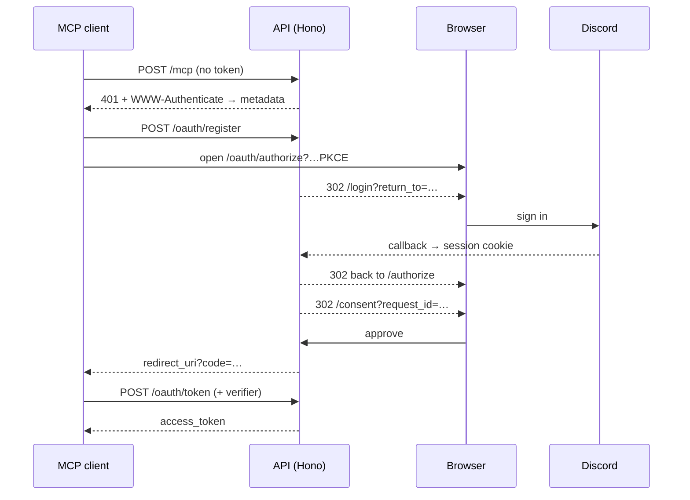

```
 ██████╗ ██╗   ██╗███╗   ███╗
██╔════╝ ╚██╗ ██╔╝████╗ ████║
██║  ███╗ ╚████╔╝ ██╔████╔██║
██║   ██║  ╚██╔╝  ██║╚██╔╝██║
╚██████╔╝   ██║   ██║ ╚═╝ ██║
 ╚═════╝    ╚═╝   ╚═╝     ╚═╝
```

**A barbell and macro log your chat client can actually use.**

`gym` is an MCP server with a deliberately small web front end. Routines, workouts, sets, food, water — all of it logged by talking to Claude (or any MCP client) instead of tapping through a tracker app between sets.

---

## Why this exists

Every training app asks you to stop what you are doing and operate a UI. Mid-set, out of breath, hands chalked, that is real friction — and friction is why logs die three weeks in. Same story with food: nobody wants to search a database for "chicken thigh, roasted" while dinner gets cold.

The chat client is already open. `"bench, 3 more at 225"` is one sentence. `"how much protein do I have left today?"` is one question. Both should be one tool call, not a screen.

So the tracker became a server and the interface became a conversation. There are 21 tools, an OAuth 2.0 flow so connecting a client is safe, and a web app that does exactly two things: sign you in, and let you approve a client. Everything else happens in chat.

## What it can do

**Routines** — the program, and its planned days.

| Tool | |
|---|---|
| `create_routine` | Create a training program |
| `get_routines` | List programs, with their sessions |
| `delete_routine` | Remove a program; logged workouts survive and unlink |
| `create_routine_session` | Add a planned day (Push, Pull, Legs) with its exercises |
| `get_routine_sessions` | Read planned days and their exercise order |
| `delete_routine_session` | Remove a planned day |

**Workouts** — what was actually trained.

| Tool | |
|---|---|
| `start_workout_session` | Open a live session, optionally from a routine day |
| `append_set_entry` | Log one completed set — `3x8` is three calls, not one |
| `end_workout_session` | Close it out |
| `get_workout_sessions` | Recent sessions with their sets |
| `get_exercises` | Search the exercise catalogue |
| `get_exercise_history` | Every recent set of one lift, newest first — call before suggesting a weight |

**Nutrition** — food, water, targets, and the calendar day they belong to.

| Tool | |
|---|---|
| `set_timezone` | Decide where the user's day starts and ends |
| `set_macro_targets` / `get_macro_targets` | Daily calorie and macro goals |
| `log_food_entry` | One item per call, macros estimated when not stated |
| `get_food_entries` / `delete_food_entry` | Read and correct the day's log |
| `log_water_entry` | Track intake |
| `get_macro_summary` | Eaten vs. remaining, broken down by meal — the "how am I doing today" tool |

Plus `ping`, which exists to prove a connection is live.

## The hard part: "today"

This sounds trivial and is not. The server runs in UTC. Postgres agreed it was `2026-08-23 01:12+00` while the person logging dinner was standing in New York at `21:12 on the 22nd`. Log that meal against `now()` and it lands on tomorrow — the single most annoying way a food tracker can lie to you.

Two servers in two regions would disagree about the same meal. `NOW()` is not an answer, and neither is the server's local clock.

So the day is resolved at write time, in the user's own zone:

- `users.timezone` holds an IANA name (`America/New_York`), set once via `set_timezone`.
- Every entry stores both `logged_at timestamptz` (the instant) and `logged_on date` (the calendar day it counts towards, computed through `Intl.DateTimeFormat` in that user's zone).
- Reads filter on `logged_on`, never on a timestamp range, over `(user_id, logged_on)` indexes.

An 11pm snack counts towards that night. A 12:05am snack counts towards the new day. The logic is checked against both 2026 DST seams, including the 01:30 that happens twice in November.

New accounts default to UTC, which is a placeholder rather than a real answer — nutrition tools return a `timezone_warning` until it is set, so the model knows to ask.

## How connecting a client works

Two identities, never confused. A **session cookie** is the human, browser only. A **bearer token** is the client, API only — and it only exists after that human clicked approve.



Details worth knowing:

- **PKCE (S256) throughout**, with dynamic client registration, advertised at `/.well-known/oauth-authorization-server`.
- **Nothing is granted until consent.** `/authorize` parks the request in Redis for ten minutes; only the approve route mints a code.
- **Consent is bound to the account that started it.** Approve and deny are `GET` navigations, because a `SameSite=Lax` cookie will not travel on a cross-site POST — so each pending request records who created it and refuses a different session. An attacker can start a flow; only their own account can ever consent to it.
- **`return_to` is origin-checked** on both sides, so an interrupted `/authorize` can resume without becoming an open redirect.
- **One MCP server per request.** Tools close over the authenticated user, so nothing leaks between callers.

## Stack

| | |
|---|---|
| API | Hono 4 · `@hono/mcp` streamable HTTP · Node |
| MCP | `@modelcontextprotocol/sdk` 1.30 |
| Data | Postgres 17 · Drizzle ORM 1.0-rc · Redis 7 for OAuth state, codes and pending consent |
| Web | Next.js 16 (App Router, RSC) · Tailwind 4 · Biome |
| Auth | OAuth 2.0 + PKCE for clients · Discord OAuth for humans |

## Quick start

```bash
pnpm install
docker compose up -d                  # postgres :5432, redis :6379

cp apps/backend/.env.example apps/backend/.env   # then fill in Discord creds
pnpm --filter backend db:push

pnpm --filter backend dev             # :8888
pnpm --filter www dev                 # :3000
```

Open `http://localhost:3000`, sign in, and point an MCP client at `http://localhost:8888/mcp`.

> Uses **pnpm** throughout. `pnpm dlx` in place of `npx`.

## Environment

**`apps/backend/.env`**

| Variable | |
|---|---|
| `NODE_ENV` | `development` \| `testing` \| `production` |
| `PORT` | Port to listen on |
| `DATABASE_URL` | Postgres connection string |
| `REDIS_CONNECTION_URI` | Redis connection string |
| `HOSTED_API_URL` | Public origin of **this** API. Every OAuth URL it advertises is built from this |
| `FRONTEND_URL` | Public origin of the web app. Login and consent redirects go here |
| `COOKIE_DOMAIN` | *Optional.* Scope for the session cookie, e.g. `.example.com`. Required when the API and the site are on different hostnames |
| `DISCORD_CLIENT_ID` / `DISCORD_CLIENT_SECRET` | From the Discord developer portal |
| `DISCORD_REDIRECT_URI` | `${HOSTED_API_URL}/auth/discord/callback`, and registered verbatim in that portal |

**`apps/www/.env.local`**

| Variable | |
|---|---|
| `NEXT_PUBLIC_API_URL` | Must equal the backend's `HOSTED_API_URL` |
| `NEXT_PUBLIC_SITE_HOST` | *Optional.* Hostname this app is served from when it is not localhost — Next blocks cross-origin dev asset requests without it. Host only, no scheme |

## Layout

```
apps/
  backend/
    src/
      routes/       auth · oauth · well-known
      middleware/   is-authenticated (cookie) · mcp-gate (bearer)
      services/     auth · tool-manager · nutrition · ownership
      tools/        one file per MCP tool, registered in index.ts
      utils/        day · urls · cookies · env · mcp · format
      db/           schema + drizzle client
  www/
    src/app/        / · /login · /consent
    src/lib/        api · session
```

Adding a tool: write the file, export a `defineTool({...})`, add one line to `tools/index.ts`. The registry is explicit on purpose — the compiler checks every entry, and registration stays synchronous.

## Deploying

The API and the site can live on separate hosts, but the session cookie has to reach both. Put them on subdomains of one domain you own and set `COOKIE_DOMAIN` to the shared parent:

```
api.example.com    →  HOSTED_API_URL
app.example.com    →  FRONTEND_URL
COOKIE_DOMAIN=.example.com
```

Two unrelated hostnames still complete the OAuth flow — every step that needs the cookie happens on the API host — but the site can never show a signed-in state, so its "already signed in, skip the login page" check goes dead.

`Secure` on the session cookie follows `HOSTED_API_URL`'s scheme, so serving the API over https is enough; there is no separate flag to remember.

## Not done yet

- Refresh grant validates a differently-derived hash than the one it stored, so token renewal fails. Access tokens last an hour.
- No sign-out route.
- Google sign-in was removed; Discord is the only provider.
- No editing of a logged set, and no personal-record tool.
- The frontend never reports the browser's timezone at sign-up — `set_timezone` is the only path.
